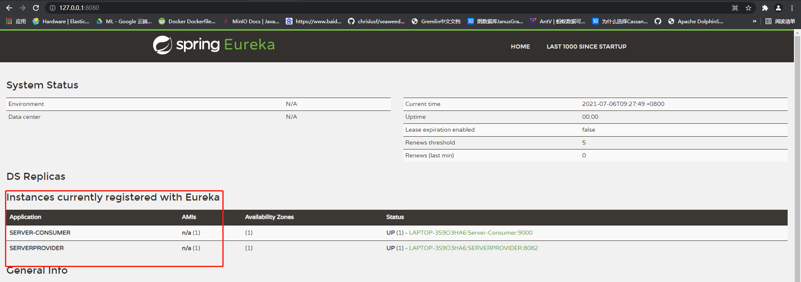

# Eureka

Eureka是由Netflix开发的一款服务治理开源框架，Spring-cloud对其进行了集成。
由3部分组成：注册中心，服务提供者（生产），服务调用者（消费）组成。
关系如图：

生产者去注册中心注册服务，消费者去注册中心获取资源，然后根据支援去请求生产者。

其中每个模块都可以是多个服务。

## 例子

分别启动 server、provider、consumer

访问<http://127.0.0.1:8080> 可以看见

直接访问consumer /info 可以看见

程序中info接口为

