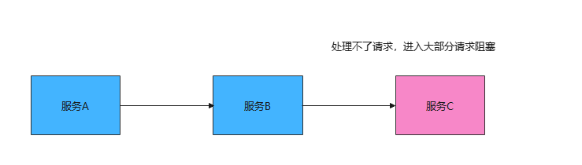
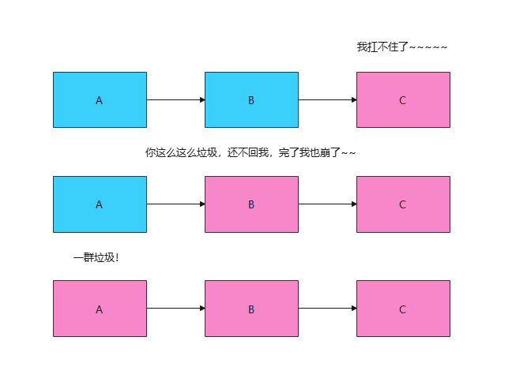

# HYSTRIX

## 熔断和降级

* 总体来说，Hystrix就是一个能进行 **熔断** 和 **降级** 的库，通过使用它可以提高整个系统的弹性。

什么是熔断和降级，为什么需要熔断和降级

举个例子：假设我们的微服务调用关系如下图A->B->C, 但是现在因为某些原因服务C顶不住了，出现有大部分请求阻塞的情况。



这个时候如果是C挂了还好，但是要注意的是，C此时不能正常的响应请求，会导致B有大量的任务阻塞，同理B也会崩溃，那么服务A也会崩溃。



这个就叫服务雪崩，熔断和降级可以解决这个的问题。

所谓 **熔断** 就是服务雪崩的一种有效解决方案。当指定时间窗内的请求失败率达到设定阈值时，系统将通过 **断路器** 直接将此请求链路断开。

也就是我们上面服务B调用服务C在指定时间窗内，调用的失败率到达了一定的值，那么 Hystrix 则会自动将 服务B与C 之间的请求都断了，以免导致服务雪崩现象。

其实这里所讲的 **熔断** 就是指的 Hystrix 中的 **断路器模式** ，你可以使用简单的 @HystrixCommand 注解来标注某个方法，这样 Hystrix 就会使用 **断路器** 来“包装”这个方法，每当调用时间超过指定时间时(默认为1000ms)，断路器将会中断对这个方法的调用。

```java
@HystrixCommand(
    commandProperties = {@HystrixProperty(name = "execution.isolation.thread.timeoutInMilliseconds",value = "1200")}
)
public List<Xxx> getXxxx() {
    // ...省略代码逻辑
}
```

**降级** 和 **断路** 又有什么区别的呢？ 个人理解 **降级** 是为了更好的用户体验，当一份方法抛出异常的时候，通过执行另一种代码逻辑来给用户友好的回复。

```java
// 指定了后备方法调用
@HystrixCommand(fallbackMethod = "getHystrixNews")
@GetMapping("/get/news")
public News getNews(@PathVariable("id") int id) {
    // 调用新闻系统的获取新闻api 代码逻辑省略
}
// 
public News getHystrixNews(@PathVariable("id") int id) {
    // 做服务降级
    // 返回当前人数太多，请稍后查看
}
```

## 仓壁模式

简单的说，在不使用仓壁模式的时候，大家都是使用同一批线程池去处理的，问题就出现了，可以因为某一个服务把线程池占满，让所有的服务都没有办法工作了。

仓壁模式就是让不同的服务之间独享线程池

```java
 @HystrixCommand(
            // 线程池标识，要保持唯⼀，不唯⼀的话就共⽤了
        threadPoolKey = "key",
        // 线程池细节属性配置
        threadPoolProperties = {
                // 线程数
                @HystrixProperty(name = "coreSize", value = "1"),
                // 等待队列⻓度
                @HystrixProperty(name = "maxQueueSize", value = "20")
        },
        // commandProperties熔断的⼀些细节属性配置,大括号里面是属性配置
        commandProperties = {
                // 每⼀个属性都是⼀个HystrixProperty，里面的属性都在HystrixCommandProperties里面定义了很多的属性
                @HystrixProperty(name = "execution.isolation.thread.timeoutInMilliseconds",
                        value = "2000")
        }
)
@GetMapping("/get")
public Object getXXX(String id) {
    // pass
}
```
