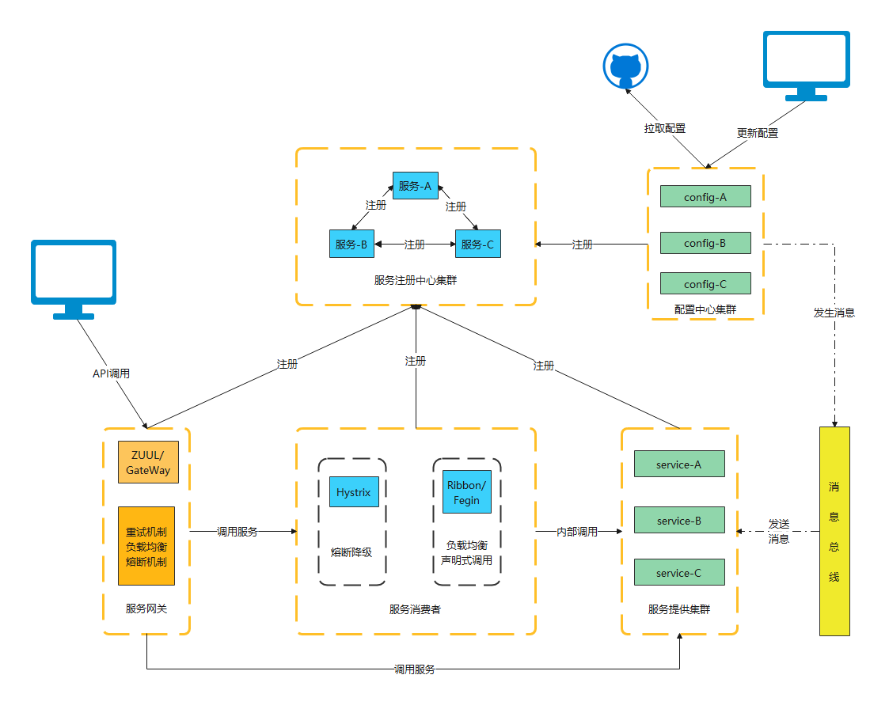

# spring cloud 入门

1. [Eureka 服务注册中心](./eureka/README.md)
2. [Ribbon 客户端负载均衡](./ribbon/README.md)
3. [Fegin 声明式服务调用](./fegin/README.md)
4. [Hystrix 熔断和降级](./hystrix/README.md)
5. [ZUUL GATEWAY 网关](./zuul/README.md)
6. [CONFIG 配置中心](./config/README.md)
7. [BUS 消息总线](./bus/README.md)

