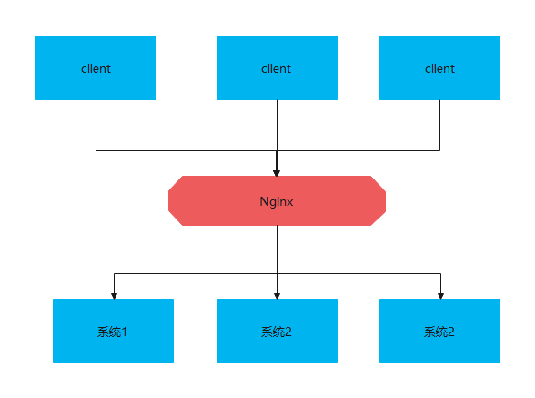
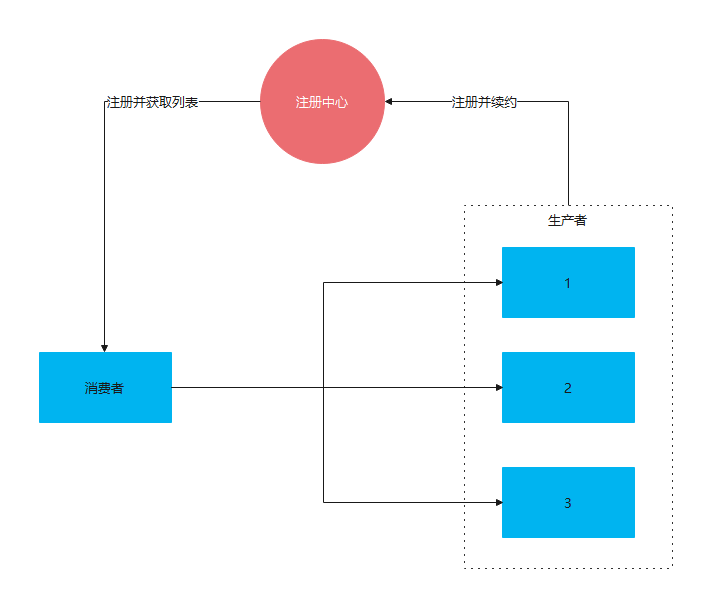

# 负载均衡 Ribbon

## RestTemplate

RestTemplate 是 spring 提供的一个访问Http服务的客户端。
微服务之间就是通过RestTemplate调用的。

```java
@RestController
public class TestController {
	
	@Autowired
	private RestTemplate restTemplate;

	@GetMapping("/info")
	public String getInfo() {
		return this.restTemplate.getForEntity("http://SERVERPROVIDER/hello", String.class).getBody();
	}
	
}
```
## Ribbon 
ribbon 是 Netflix 的一个开源的负载均衡项目。
spring cloud 2020.0.3版本中 spring-cloud-starter-netflix-eureka-client 会自动引入并启动 ribbon服务，无需在单独引入。
通过@LoadBalanced 注解表示RestTemplate会走负载均衡
```java
@Bean
@LoadBalanced
RestTemplate restTemplate() {
	return new RestTemplate();
}
```

## Ribbon如何负载均衡的？
提起负载均衡很多人会想起Nginx。

nginx的负载均衡的模式如下图：


ribbon的负载均衡如下图：


可以看出Ribbon是在客户端进行负载均衡。nginx会把所有请求收集到一起在做转发。

## Ribbon的负载均衡模式
* RoundRobinRule：轮询策略
* RandomRule: 随机策略
* RetryRule: 重试策略

spring 配置

```yaml
Server-Provider:
  ribbon:
    NFLoadBalancerRuleClassName: com.netflix.loadbalancer.RandomRule
```

* 代码参考eureka