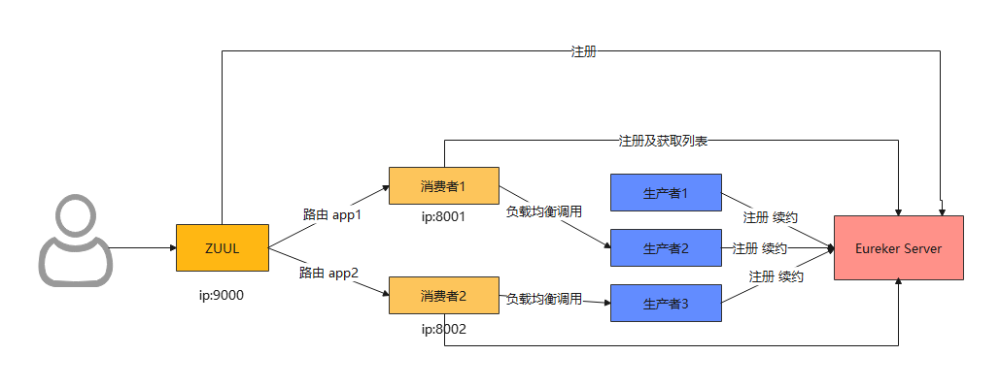
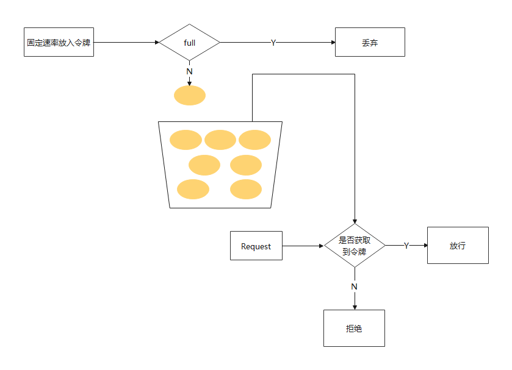

# ZUUL

ZUUL 是从设备和 web 站点到 应用后端的所有请求的前门

spring clould 中存在很多服务对外提供服务，往往用户或应用可以直接访问这些服务。但是上述方式没有一个统一的服务入口不便于访问和管理，而ZUUL就是一个最消费者统一的入口。

就和官网标题一样 Router and Filter : Zuul, Zuul 的主要功能就是路由和过滤。



## 统一前缀

```yml
zuul:
  prefix: /zuul
```

## 路由策略配置

首先ZUUL也需要向Eureker进行注册，为什么要注册呢？

因为需要拿到消费者地址及信息。拿到消费者地址及信息有什么好处呢？

```yml
zuul:
  routes:
    consumer1: /app1/**
    consumer2: /app2/**
```

<http://ip:8001/info> 就变成 <http://ip:9000/app1/info>

## 服务名屏蔽

```yml
zuul:
  ignore-services: "*"
```

## 路径屏蔽

```yml
zuul:
  ignore-patterns: **/auto/**
```

## 敏感请求头屏蔽

默认情况下，像 Cookie、Set-Cookie 等敏感请求头信息会被 zuul 屏蔽掉，我们可以将这些默认屏蔽去掉，当然，也可以添加要屏蔽的请求头。

## Zuul 的过滤功能

如果说，路由功能是 Zuul 的基操的话，那么过滤器就是 Zuul的利器了。毕竟所有请求都经过网关(Zuul)，那么我们可以进行各种过滤，这样我们就能实现 限流，灰度发布，权限控制等等。

## 令牌桶限流



首先我们会有个桶，如果里面没有满那么就会以一定 固定的速率 会往里面放令牌，一个请求过来首先要从桶中获取令牌，如果没有获取到，那么这个请求就拒绝，如果获取到那么就放行。

```java
@Component
@Slf4j
public class RouteFilter extends ZuulFilter {
    // 定义一个令牌桶，每秒产生2个令牌，即每秒最多处理2个请求
    private static final RateLimiter RATE_LIMITER = RateLimiter.create(2);
    @Override
    public String filterType() {
        return FilterConstants.PRE_TYPE;
    }
 
    @Override
    public int filterOrder() {
        return -5;
    }
 
    @Override
    public Object run() throws ZuulException {
        log.info("放行");
        return null;
    }
 
    @Override
    public boolean shouldFilter() {
        RequestContext context = RequestContext.getCurrentContext();
        if(!RATE_LIMITER.tryAcquire()) {
            log.warn("访问量超载");
            // 指定当前请求未通过过滤
            context.setSendZuulResponse(false);
            // 向客户端返回响应码429，请求数量过多
            context.setResponseStatusCode(429);
            return false;
        }
        return true;
    }
}
```

## Spring boot 高版本不在支持ZUUL 用spring cloud gateway来代替

SpringCloud官方，对SpringCloud Gateway 特征介绍如下：

 1. 基于 Spring Framework 5，Project Reactor 和 Spring Boot 2.0
 2. 集成 Hystrix 断路器
 3. 集成 Spring Cloud DiscoveryClient
 4. Predicates 和 Filters 作用于特定路由，易于编写的 Predicates 和 Filters
 5. 具备一些网关的高级功能：动态路由、限流、路径重写
从以上的特征来说，和Zuul的特征差别不大。SpringCloud Gateway和Zuul主要的区别，还是在底层的通信框架上。 采用netty作为底层通信框架，性能更好。
